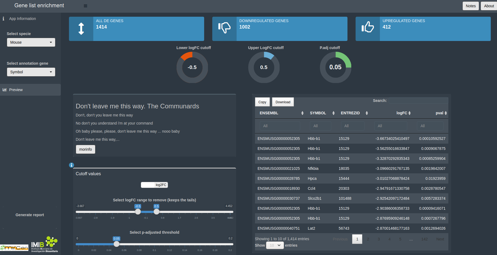
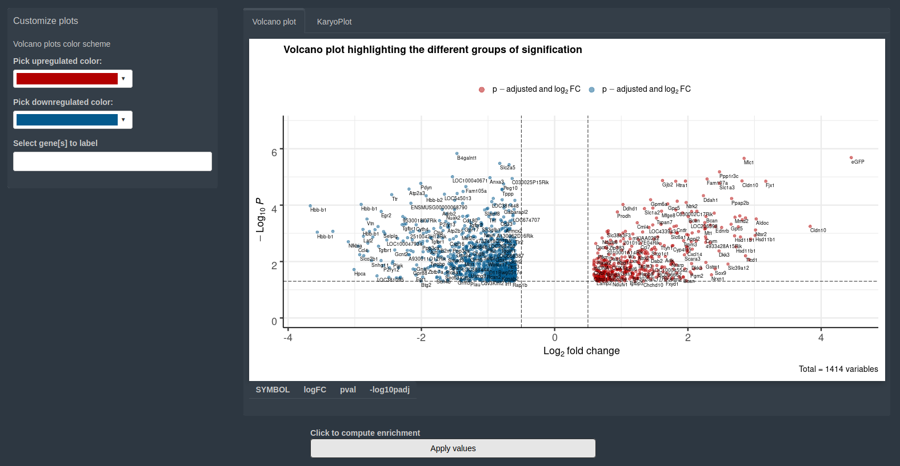
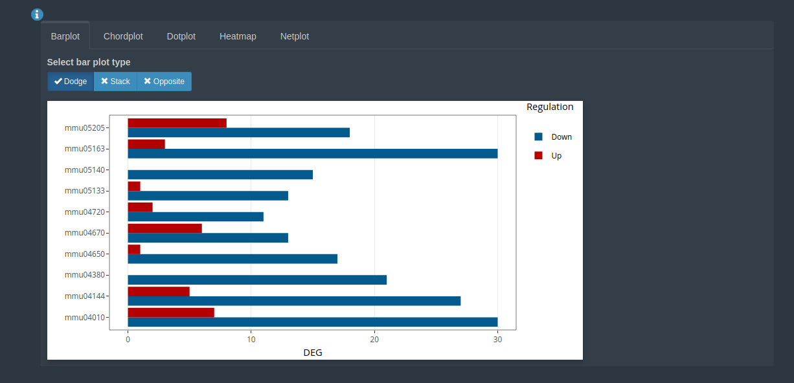

```{r setup, include=FALSE, echo=FALSE}
knitr::opts_chunk$set(echo = FALSE)
# ffmpeg -i prueba2.mp4 kk.gif
## renderizar el Rmd a md con:
# rmarkdown::render(input = "help.Rmd", output_file = "help.md", output_format = rmarkdown::md_document() )

```

## Presentación en pruebas

Pues eso, que le das al botón preview y sale esto



## otra cosa

<video width="680" height="420" loop controls>
  <source src="output.webm" type="video/webm">
</video>

## Volcano plot

El volcano plot es pechiocho



## kegg

Y cuando le das a enrich, salen un montón de cosicas



